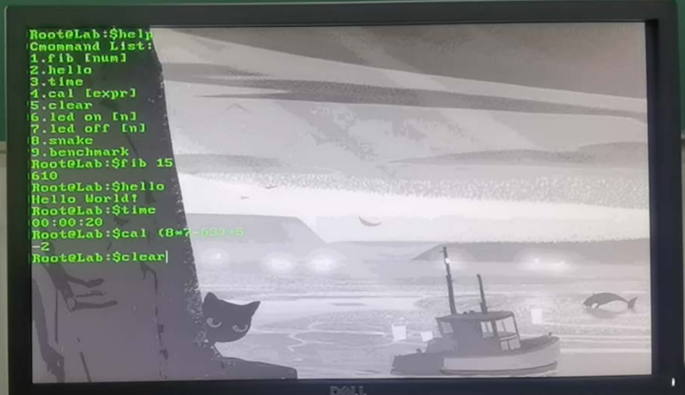

# **Calculate-System**

这是NJU开设的一门数字逻辑与计算机组成实验课程的大实验，最后通过Verilog HDL及C语言，从硬件设计到软件层面实现一个完整的计算系统，并且能够执行简单的命令，具有一系列功能。

### 实现功能

******

##### 硬件部分 

1.流畅运行的 50MHz 单周期 CPU 
2.接受键盘输入并快速回显在屏幕上 
3.支持换行、删除、上滚屏与下滚屏 
4.支持闪烁光标、光标上下左右移动 
5.当光标在行首时，删除回车键，光标返回上一行字符串末尾 
6.七段数码管实时更新显示系统时间 
7.外设种类增加，支持对板载 LED、板载七段数码管的控制 
8.显示器复杂度增加，提供字符画的开机界面及简易图形界面 

##### 软件部分 

1.hello 指令，打入 hello，显示 Hello World! 
2.time 指令，打入 time，显示系统时间，与七段数码管显示一致 
3.fib n 指令，打入 fib n 计算斐波那契数列并回显结果 
4.help 指令，打入 help，显示所有可执行指令集合 
5.打入未知指令，输出 Unknown Command 
6.简单表达式计算，cal n 指令，打入后计算表达式 n 的值，支持括号及加减乘除运算 
7.移植了贪吃蛇小游戏，snake 指令，打入 snake 开始贪吃蛇小游戏，死亡后结束游 戏。操作时需开启小键盘的键盘锁控制方向 
8.移植了简易的 testbench，用于测定每秒执行的加减乘除指令次数，对 CPU 进行性能 评估 9.实现了部分简易的 C 语言库函数用以支持所有指令的实现

### 文件目录

******

### 成果演示

*****

